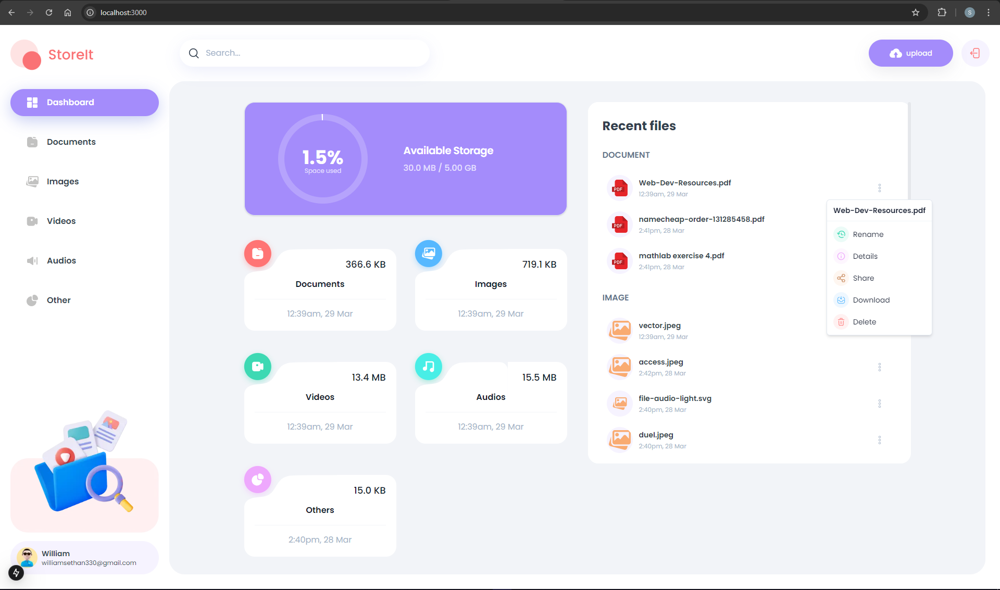
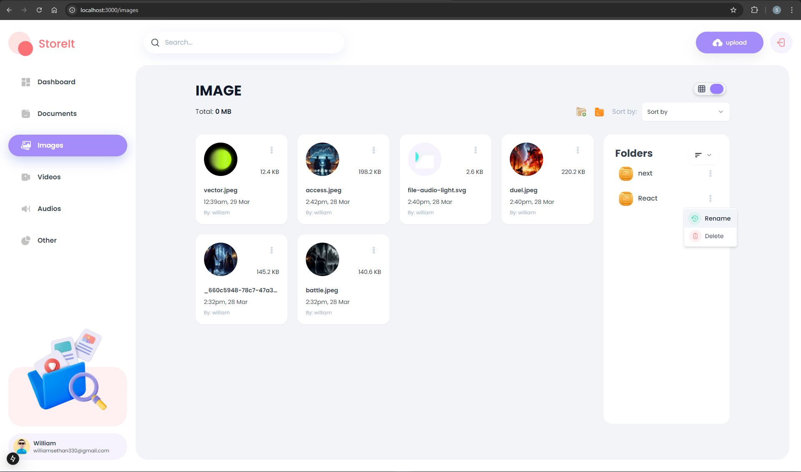

# Google Drive Clone


## 📌 About the Project

A cloud storage web application inspired by Google Drive, enabling users to create folders, upload files, and manage permissions. Users can share files with specific access controls, ensuring secure and efficient collaboration.

---

## 📸 Project Screenshots

### Screenshot 1: Authentication


### Screenshot 2: Dashboard View


### Screenshot 3: File Upload Interface


### Screenshot 4: Folder Management


### Screenshot 5: File Sharing Permissions


### Screenshot 6: Mobile View/tablet of the App


### Screenshot 6: Files View of the App


---

## 📑 Index

- [Features](#features)
- [Built With](#built-with)
- [Installation](#installation)
- [How It Works](#how-it-works)
- [Support](#support)
- [Contribute](#contribute)
- [License](#license)

---

## 🚀 Features

✅ **Authentication & Security**

- User authentication with **NextAuth**
- **Email verification** on signup
- **OAuth login** (Google, GitHub, etc.)

✅ **File Management**

- Create **folders** and **upload files**
- Categorize files based on type (Images, Videos, Documents, etc.)
- **AWS S3** for cloud storage
- **CloudFront CDN** for optimized delivery

✅ **File Sharing & Access Control**

- Share files with specific users
- Set custom **permissions**:
  - **Download**
  - **Rename**
  - **Share**
- Only users with granted permissions can perform respective actions

✅ **Performance & Deployment**

- **Dockerized** for easy deployment
- Hosted on **AWS** for scalability

---

## 🛠 Built With

- **Frontend**: Next.js, Tailwind CSS, ShadCN UI
- **Backend**: Express, Prisma, NextAuth
- **Database**: PostgreSQL
- **Storage & CDN**: AWS S3, AWS CloudFront
- **Deployment**: Docker, EC2

---

## 📦 Installation

### Running Locally

#### 1️⃣ Clone the repository

```sh
git clone https://github.com/yourusername/google-drive-clone.git
cd google-drive-clone
```

#### 2️⃣ Install dependencies

```sh
yarn install
```

#### 3️⃣ Set up environment variables

Copy `.env.example` to `.env` and configure the following:

```env
DATABASE_URL=your_database_url
NEXTAUTH_SECRET=your_secret_key
AWS_ACCESS_KEY_ID=your_aws_key
AWS_SECRET_ACCESS_KEY=your_aws_secret
S3_BUCKET_NAME=your_s3_bucket
```

#### 4️⃣ Start the database using Docker or using neonDB link with DATABASE_URL

```sh
docker run -e POSTGRES_PASSWORD=mysecretpassword -p 5432:5432 -d postgres
```

#### 5️⃣ Generate Prisma Client

```sh
npx prisma generate
```

#### 6️⃣ Run database migrations

```sh
npx prisma migrate dev
```

#### 7️⃣ Start the frontend development server /Google-drive-clone/apps/client

```sh
yarn dev
```

Your app should now be running at [http://localhost:3000](http://localhost:3000) 🚀

---

#### 8️⃣ Start the backend development server /Google-drive-clone/apps/api

```sh
yarn dev
```

Your app should now be running at [http://localhost:3001](http://localhost:3001) 🚀

---

## ☁️ Deployment

This project is containerized using Docker. To deploy, use:

```sh
docker-compose build
```

For AWS deployment:

- Use EC2 instance with Docker
- Set up a reverse proxy using NGINX
- Configure your S3 bucket & CloudFront for file storage

---

## 🔍 How It Works

1️⃣ **Authentication**

- Users sign up with email verification
- OAuth login is available for seamless access

2️⃣ **File Upload & Storage**

- Files are uploaded to AWS S3
- Folders and files are categorized dynamically

3️⃣ \*\*File Sharing & Permissions

- Users can share files with specific access levels.

- Cascading Permissions:

  - If the owner grants "Share" permission to a user, that user can further share the file with others.

  - When sharing the file, the shared user can also specify permissions (Download, Rename, Share) for the next recipient.

  - This chain continues as long as the "Share" permission is passed down.

  - If the owner does not grant the "Share" permission, the user cannot share it with others.

- Other permissions (Download, Rename) also follow the same rule—only users with explicit permission can perform those actions.

4️⃣ **Deployment & Performance**

- Prisma ORM manages database operations
- AWS CloudFront optimizes file delivery
- Docker ensures smooth deployment

---

## 📌 Roadmap

This project is actively being improved. Below are some upcoming features and enhancements:

- 📂 Improve file & folder management (instant renaming, better loading states).
- 🚀 Enhance performance (caching thumbnails, optimizing downloads).
- 🛠 Improve error handling and state management.
- 🖼 UI/UX improvements (better mobile view, breadcrumb navigation).
- 🔧 Infrastructure & Scalability

For the full list of planned improvements, check out the [TODO.md](./TODO.md) file.

---

## 💡 Support

If you find this project useful, please consider giving it a ⭐ on GitHub.

---

## 🤝 Contribute

This project is a work in progress! If you'd like to contribute, check out the [TODO.md](./TODO.md) for a list of pending improvements.

---

## 📝 License

MIT License – Free to use and modify.
